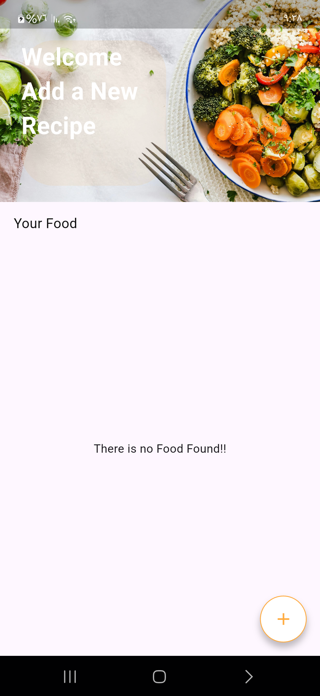
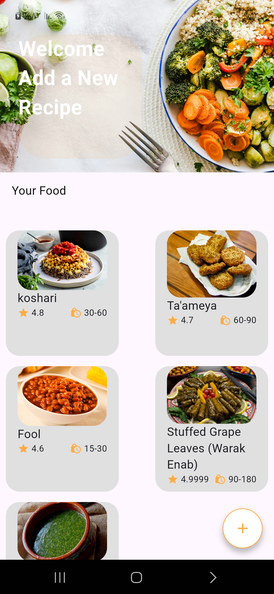
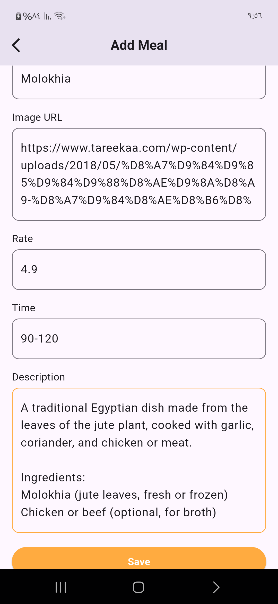
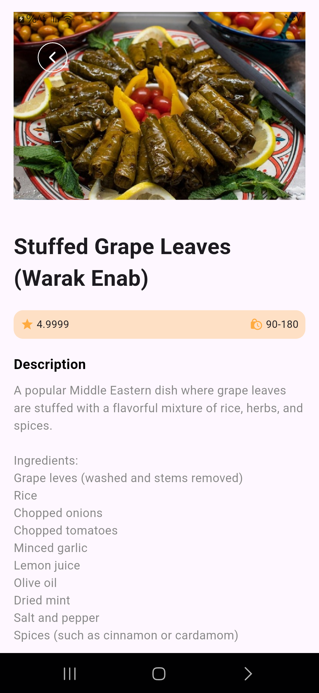

# meals_app

Meal app using flutter

## App Description
This App store foods that the user add in local database.

## Technologies used
- Flutter
- Shared Preferences
- Local Database

## App Images

